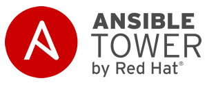

# Ansible Tower Workshop - AWS Version



`Ansible_Tower_Workshop` is a ansible playbook to provision Ansible Tower in AWS. This playbook uses Ansible to wrap Terraform, for provisioning AWS infrastructure and nodes. To find more info about Terraform [check here](https://www.terraform.io/docs/providers/aws/index.html)

These modules all require that you have AWS API keys available to use to provision AWS resources. You also need to have IAM permissions set to allow you to create resources within AWS. There are several methods for setting up you AWS environment on you local machine.

Fill out `env.sh` & Export the AWS API Keys

First, copy env.sh_example to env.sh, and then fill in your API keys.  Once that is complete, source the script, to export your AWS environment variables.

```
source env.sh
```

This repo also requires that you have Ansible installed on your local machine. For the most upto date methods of installing Ansible for your operating system [check here](http://docs.ansible.com/ansible/intro_installation.html).

This repo also requires that Terraform be installed if you are using the aws.infra.terraform role. For the most upto data methods of installing Terraform for your operating system [check here](https://www.terraform.io/downloads.html).


## AWS Infrastructure Roles


### roles/aws.infra.terraform

To create infrastructure and a Ansible Tower instance via Terraform:

#### OS X
```
sudo easy_install pip
sudo pip install boto
sudo pip install boto3
sudo pip install ansible
sudo pip install passlib
/usr/bin/ruby -e "$(curl -fsSL https://raw.githubusercontent.com/Homebrew/install/master/install)"
brew install terraform
```

#### RHEL/CentOS
```
sudo yum install https://dl.fedoraproject.org/pub/epel/epel-release-latest-7.noarch.rpm
# server
subscription-manager repos --enable="rhel-7-server-rpms" --enable="rhel-7-server-extras-rpms" --enable="rhel-7-server-optional-rpms"
# workstation
subscription-manager repos --enable="rhel-7-workstation-rpms" --enable="rhel-7-workstation-extras-rpms" --enable="rhel-7-workstation-optional-rpms"
sudo yum -y install python2-boto ansible
wget https://releases.hashicorp.com/terraform/0.9.11/terraform_0.9.11_linux_amd64.zip # current release as of this date...check to see if a newer version is availabke
sudo unzip terraform_0.9.11_linux_amd64.zip -d /usr/local/bin terraform
```

#### Fedora 25/26
```
sudo dnf -y install python2-boto ansible
wget https://releases.hashicorp.com/terraform/0.9.11/terraform_0.9.11_linux_amd64.zip # current release as of this date...check to see if a newer version is availabke
sudo unzip terraform_0.9.11_linux_amd64.zip -d /usr/local/bin terraform
```
# Custom Variable Requirements
* Copy `group_vars/all_example.yml` to `group_vars/all.yml`
* Fill in the following fields:
```
  workshop_prefix  : defaults to "tower", set to the name of your workshop
  jboss            : defaults to "true", change it to false if you don't want to do the jboss steps in Exercise 1.0
  graphical        : defaults to "true", change it to false if you don't want a graphical desktop for students to run Microsoft VS Code from
  aws_access_key   : your Amazon AWS API key
  aws_secret_key   : your Amazon AWS secret key
  domain_name      : your DNS domain, likely "redhagov.io"
  zone_id:         : the AWS Route 53 zone ID for your domain
  tower_rhel_count : the number of tower instances, usually 1 per student
  rhel_count       : the number of regular RHEL instances, usually 1 per student
  win_count        : the number of Windows 2016 instances, currently not used
  region:          : defaults to "us-east-2", set to any region
  rhel_ami_id      : defaults to "us-east-2" AMIs, uncomment us-east-1, or add your preferred region, as desired.  There are both JBoss-enabled and plain RHEL instances avalable
  win_ami_id       : similarly to "rhel_ami_id", uncomment to match your region choice
  workshop_passwoed: pick a password for your students to login with
  rabbit_password  : pick a password for RabbitMQ in Tower, usually not needed
  local_user       : if you are using a Mac, uncomment the Mac-specific entry, and comment the RHEL/Fedora one
```
**IMPORTANT!:**
For the Maven/JBoss steps in Exercise 1.0 to work, you must have a JBoss-enabled Cloud Access AMI, or you must disable Cloud Access, and use a traditional subscription, as shown below.  It is recommended that you enable Cloud Access and NOT use a traditional subscription as there is a known/unresolved bug when connecting to Red Hat servers.  
While logged into AWS Console, under Images click on 'AMIs', click on dropdown next to search bar and select 'Private Images'. Search for 'EAP' and use the AMI ID for the most recent release of RHEL.

**NOTE: If following this recommendation, your variables will look like this:**

```
# subscription_manager     |      Red Hat Subscription via Cloud Access
cloud_access:                     true
# subscription_manager     |      Red Hat Subscription via activation key and org id
rhsm_activationkey:               ""
rhsm_org_id:                      ""
# subscription_manager     |      Red Hat Subscription via username & password
username:                         ""
password:                         ""
pool_id:                          ""
```
**NOTE: If you choose the traditional RHSM route, your variables will look something like this**

Red Hat Subscription Manager uses **_either_** an `activation key / org id` combination or a `username/password` combination, not both.
```
# subscription_manager     |      Red Hat Subscription via Cloud Access
cloud_access:                     false
# subscription_manager     |      Red Hat Subscription via activation key and org id
rhsm_activationkey:               "myactkey"
rhsm_org_id:                      "12345678"
# subscription_manager     |      Red Hat Subscription via username & password
username:                         "user@company.com"
password:                         "my_password"
pool_id:                          "1234567890abcdef01234567890abcde"
```

#### Provision Workshop Nodes

```
ansible-playbook 1_provision.yml  
```
#### Install packages and configure the newly provisioned nodes.

```
ansible-playbook 2_load.yml
```

#### To destroy the workshop environment

```
ansible-playbook 3_unregister.yml
rm -rf .redhatgov
```

## Login to the primary workshop node

Browse to the URL of the EC2 instance and enter the `ec2-user`'s password `workshop_password:` located in `group_vars/all.yml`.

```
https://{{ workshop_prefix }}.tower.0.{{ domain_name }}:8888/wetty/ssh/ec2-user
```

## Alternative interface: RDP (Microsoft Remote Desktop)

Users of the workshop can, alternatively, login to the Tower nodes, using a Microsoft Remote Desktop (RDP) client.  This service is running on the standard port of 3389.  Once in, you will have a GNOME graphical session, with Microsoft Vidual Studio Code and the Firefox browser, to do the workshop.  All Wetty terminal commands can be entered into the GNOME terminal, and will work the same way.  Copy and paste functionality is verified using Microsoft's official client, and using Remmina, from Fedora.

