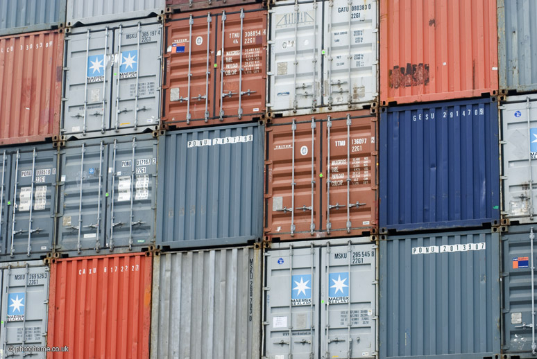

# Container Security Playbook




## Dependencies:

### Role: sendgrid

    sudo pip install sendgrid==2.2.1

### Role: Wetty

    sudo pip install passlib

These modules all require that you have AWS API keys available to use to provision AWS resources. You also need to have IAM permissions set to allow you to create resources within AWS. There are several methods for setting up you AWS environment on you local machine.


### Export AWS API Keys:

Fill out `env.sh` & Export the AWS API Keys ;

```
source env.sh
```

This repo also requires that you have Ansible installed on your local machine. For the most upto date methods of installing Ansible for your operating system [check here](http://docs.ansible.com/ansible/intro_installation.html).

This repo also requires that Terraform be installed if you are using the aws.infra.terraform role. For the most upto data methods of installing Terraform for your operating system [check here](https://www.terraform.io/downloads.html).

## group_vars/all

#### Workshop prefix

Change the workshop prefix in `group_vars/all`. This allows multiple people to operatin in AWS without stepping on each others resources. I t also flows down to all AWS Tags as well.  

```
workshop_prefix:              "changeme"
```

#### AWS Settings


Fill in this vars file with your AWS API keys, Red Hat subscription, and domain names. 

```
# aws.infra.terraform  |  AWS API KEYS
aws_access_key:               ""
aws_secret_key:               ""
# aws.infra.terraform  |  AWS Route 53
domain_name:                  ""
zone_id:                      ""
# aws.infra.terraform  |  Red Hat Subscription
username:                     ""
password:                     ""
pool_id:                      ""
```


## Provision

```
ansible-playbook -i inventory 1_provision.yml
```

## Configure

```
ansible-playbook -i inventory 2_configure.yml
```


## Access the instance in AWS:

Browse to the URL of the EC2 instance and enter the `ec2-user`'s password (workshop_password:) located in `group_vars/all`. 

```
https://{{ workshop_prefix }}.0.{{ domain_name }}:8888/wetty/ssh/ec2-user
```

## Destroy All

To destroy only the resources you provisioned via terraform

```
cd .terraform
terraform destroy
```